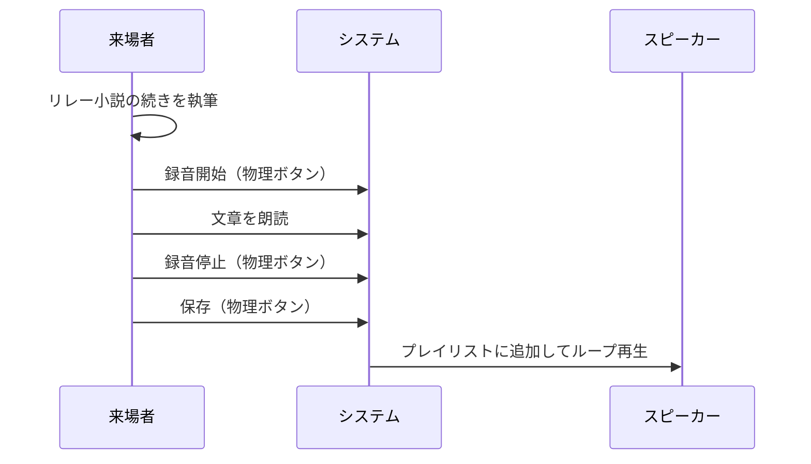
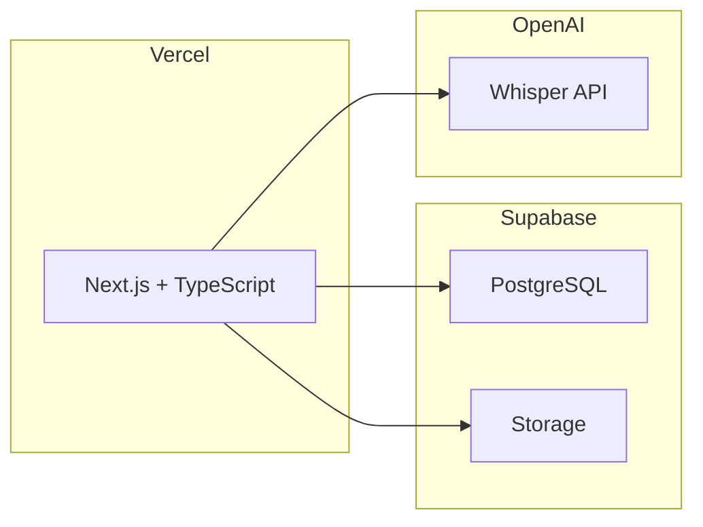
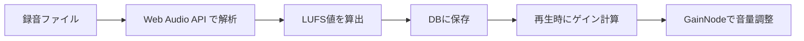
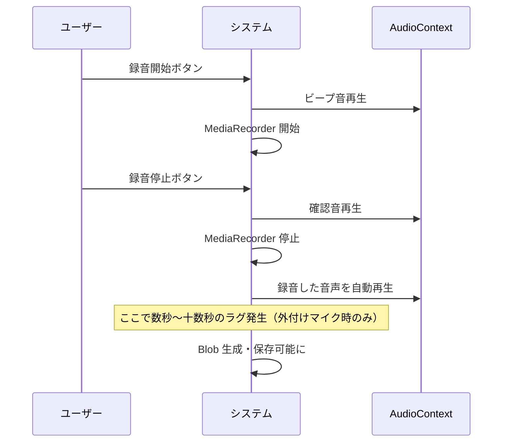
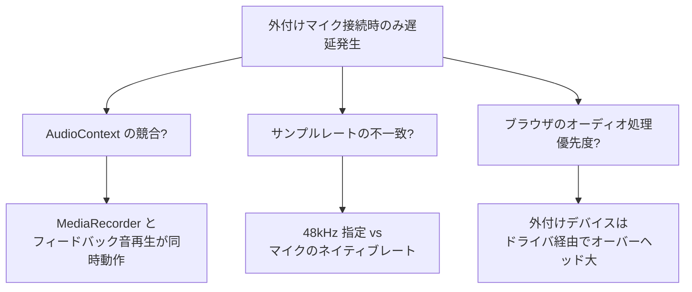

# 導入

こんにちは！スマートキャンプ株式会社の松下です。この記事は[スマートキャンプ株式会社のアドベントカレンダー 2025](https://qiita.com/advent-calendar/2025/smartcamp) の記事として執筆しています。しかし、内容は仕事には関係ないプライベートでの活動についてになっています。何卒ご了承ください。

## 芸術祭への出展

この度、 [ATAMI ART GRANT 2025](https://atamiartgrant.com/])というイベントに、出展作家側で参加しました。熱海の街にあるマンションやお店で様々な芸術作品を展示するイベントです。


_公式ホームページスクリーンショット_

今回私が作成したのはイベント全体のシステム（Web ページ等）ではなく、**イベントに出展している作品**です。友人が [モノ・シャカ](https://www.monoshaka.com/) という小説同人誌を主宰しており、上記のイベントで展示を行うことになり、システム制作で協力したといった次第です。

展示の概要は以下です。

1. 来場者にリレー小説の文章を書いてもらう
2. 録音ブースに入ってもらい、マイクに向かって録音・保存してもらう
3. 録音された音声を会場でループ再生する



来場者が直接システムを操作する形にすると混乱を招く可能性があったため、録音ブースの物理ボタンのみを操作してもらう形にしました。この記事では、そのシステムについて説明します。

# システム概要

運営スタッフが録音・再生・管理を行うためにシンプルな Web アプリケーションを作成しました。


_作成したシステム_

## 主な機能

- **録音**: ブラウザ上でマイクから音声を録音し保存
- **再生**: プレイリスト内の録音を連続ループ再生
- **管理**: 録音の並び替え、削除、文字起こし生成、音量調整

録音・再生・管理機能は 1 つのページに統合されており、録音を追加しながら再生を続けることができるように実装しました。
元々は録音と再生は別のデバイスで行う予定でそれぞれ別のページで実装していましたが、一つの PC で行う必要が後から出てきたため、一つの画面で完結させるようにしました。

## 技術スタック

| カテゴリ                    | 技術                              |
| --------------------------- | --------------------------------- |
| フロントエンド/バックエンド | Next.js (App Router) + TypeScript |
| データベース・ストレージ    | Supabase (PostgreSQL + Storage)   |
| ホスティング                | Vercel                            |
| 文字起こし                  | OpenAI Whisper API                |



## アーキテクチャの選定について

以下のような非機能要件がありました。

- とにかく早く形にできること
  - 要件仕様の検討を始めた段階で、開催まで 2 週間ほどしかなかった
  - 会期の間しか利用されず、継続的にメンテし続けるのものではなかった

最終的に Next.js を 採用し、Vibe Coding で実装、インフラは Vercel で構築し、DB やストレージ、API サーバーとして Supabase を利用することにしました。

### Vercel

Vercel は、[過去に仕事で利用した経験](https://zenn.dev/smartcamp/articles/56fe441bb56f97) があり利用方法に関するキャッチアップが必要ないことがメリットでした。

GitHub と連携すれば自動的に CI/CD を構築してくれることも、今回のような時間がない状況にあっていました。リポジトリに push するだけで自動的にビルド・デプロイが走り、PR を作ればプレビュー環境も自動で作成されます。インフラの設定に時間を取られることなく、アプリケーションの開発に集中できました。

[過去の私の記事](https://zenn.dev/smartcamp/articles/9d9b4224be862f#api%E3%81%AE%E5%AE%9F%E8%A1%8C%E3%81%8Cserverless-function%E3%81%AB%E3%81%AA%E3%82%8B) にも書きましたが、Vercel 上で Route Handler を動かす場合、おそらく実体は AWS Lambda のような Serverless Function になります。これらには実行時間の制限があるため、Route Handler で時間のかかる処理を行う場合にはネックになることがありますが、今回のアプリケーションでは文字起こしのために OpenAI の Whisper を叩く程度で、かつ音声ファイルの長さも短かったので問題にはなりませんでした。

### Supabase

Supabase についても、本番利用は行わなかったものの過去に仕事で技術調査自体は行っており、こちらもキャッチアップがあまり必要ありませんでした。複雑なビジネスロジックを持つことがない今回のようなアプリケーションでは、[Supabase が PostgREST で提供してくれる RESTful API](https://supabase.com/docs/guides/api) を利用することで、バックエンド実装の時間を大幅に削減することができました。

#### Storage

録音した音声ファイルの保存には Supabase Storage を利用しました。S3 互換のオブジェクトストレージで、JavaScript クライアントから簡単にファイルをアップロードできます。

```typescript
const { error } = await supabase.storage
  .from("recordings")
  .upload(filePath, blob, { contentType: "audio/webm" });
```

プレイリストごとにフォルダを分けて管理し、ファイルパスを DB に保存することで、録音データとメタデータを紐付けています。

#### Auth

アクセス制限には Supabase Auth を利用しました。メールアドレスとパスワードによるシンプルな認証で、`signInWithPassword` メソッドを呼ぶだけでログイン処理が完了します。

DB 側では Row Level Security (RLS) を設定し、認証ユーザーのみが操作を行うことができるようにしました。

# トラブルとその解決

短期間で実装を行い運用を開始したため、会期中には様々なトラブルが発生しました。

## 音量が均一ではない

来場者の方には、専用の録音ブースで録音を行ってもらいましたが、人によって声の大きさやマイクとの距離が異なるため、録音ごとに音量がバラバラになってしまいました。
連続再生すると、ある録音は小さく、次の録音は大きく聞こえるという状態で、展示としての体験を損なっていました。

### 解決策：LUFS を使った音量正規化

音量を揃えるために、LUFS（Loudness Units relative to Full Scale）という指標を使いました。
LUFS は人間の聴覚特性を考慮したラウドネスの単位で、放送業界などで音量の標準化に使われています。

実装は以下の流れです。

1. **音量分析**: 各録音ファイルを Web Audio API で解析し、LUFS 値を算出
2. **メタデータ保存**: 算出した LUFS 値を DB に保存
3. **再生時にゲイン調整**: 目標の LUFS 値との差分からゲイン値を計算し、GainNode で音量を調整



ゲイン値の計算は以下の式で行っています。

```
gain = 10 ^ ((targetLUFS - currentLUFS) / 20)
```

ただし、極端な音量調整を避けるため、ゲイン値は 0.1〜3.0 倍の範囲に制限しています。

### Web Audio API での実装

再生時は、Audio 要素を Web Audio API の GainNode に接続してゲインを適用しています。

```
Audio要素 → MediaElementAudioSourceNode → GainNode → 出力
```

これにより、録音ごとに異なる音量を統一したレベルで再生できるようになりました。

なお、今回の LUFS 計算は RMS ベースの簡易的な近似値です。正式な ITU-R BS.1770 規格では K-weighting フィルタやゲート処理が必要ですが、展示用途では十分な精度でした。

### 本来の理想的なアプローチ

本来であれば、サーバーサイドで FFmpeg などを使って音声ファイル自体を正規化処理するのが理想的です。ファイル自体を処理すれば、再生環境に依存せず確実に音量を揃えられます。

しかし、今回は実装期間が限られていたため、サーバーサイドでの音声処理は断念しました。Vercel の Serverless Function 上で FFmpeg を動かす環境構築や、処理後のファイル管理の実装に時間がかかると判断したためです。

再生時にクライアントサイドでゲイン調整する方式は、Web Audio API の知識があれば比較的短時間で実装できました。展示期間中に問題なく動作したため、今回のケースでは十分な選択だったと考えています。

## 外付けマイク使用時の保存遅延

録音の UX を向上させるため、当初は以下の機能を実装していました。

- 録音開始時にビープ音を鳴らす（Web Audio API で生成）
- 録音終了時に確認音を鳴らす
- 録音終了後に録音した音声を自動再生する

しかし、外付けマイクを接続した環境でのみ、録音した音声ファイルが保存できるようになるまで数秒〜十数秒のラグが発生するという問題が起きました。MacBook Air の内蔵マイクでは再現せず、外付けマイクを接続したときにだけ発生する現象でした。



### 考えられる原因

原因を特定することはできませんでしたが、以下のような要因が考えられます。



1. **AudioContext の競合**: 録音用の MediaRecorder と、フィードバック音再生用の AudioContext が同時に動作することでリソースが競合
2. **サンプルレートの不一致**: 録音時に 48kHz を指定していたが、外付けマイクのネイティブサンプルレートと異なる場合リサンプリング処理が発生
3. **ブラウザのオーディオ処理の優先度**: 外付けデバイスはドライバを経由するため処理のオーバーヘッドが大きい

### 対応

原因の特定と修正に時間をかける余裕がなかったため、フィードバック音と自動再生機能を削除して対応しました。
録音のフィードバックは画面上の表示のみとし、音声による通知は諦めました。展示としては問題なく運用できましたが、UX の観点では妥協した部分です。

# まとめ

芸術祭の展示用に、録音・再生・管理機能を持つ Web アプリケーションを開発しました。

開発期間が 2 週間程度と限られていたため、過去に経験のある Vercel + Supabase の構成を採用し、Vibe Coding で短期間での実装を実現しました。Supabase の RESTful API を活用することでバックエンド実装を省略でき、フロントエンドに集中できたことが大きかったです。

会期中には音量のばらつきや外付けマイク使用時の遅延といった問題が発生しましたが、LUFS を使った音量正規化やフィードバック音の削除といった対応で乗り切りました。理想的な実装ではない部分もありましたが、限られた時間の中で「動くもの」を優先した判断は正しかったと思います。

今回の経験を通じて、短期間でのプロトタイピングにおける技術選定の重要性と、完璧を目指すよりもまず動かすことの大切さを改めて実感しました。

# 余談

冒頭の[小説同人誌](https://www.monoshaka.com/)には、私も小説を書いて寄稿しました。小説の執筆は初めての経験で、補助のために Claude Code を用いた校正システムを構築して利用していました。体験が良かったのでこれもまた記事にしたいと思っています。
